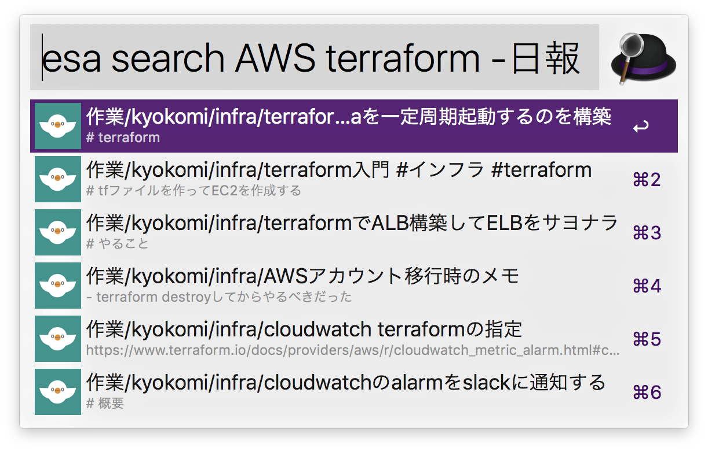

alfred-esa-workflow
======================



## Install
Download [latest version of Alfred esa Workflow](https://github.com/kyokomi/alfred-esa-workflow/releases/latest) and double-click esa.alfredworkflow to install it.

## Usage
### Search Posts

```
esa search <query>
```

### Setup personal token and team name
Get Personal Token which have a scope for read and put it on:

`https://<your team name>.esa.io/user/applications`

```shell
esa setup <accessToken> <teamName>
```

## License
[MIT](LICENSE.md)
